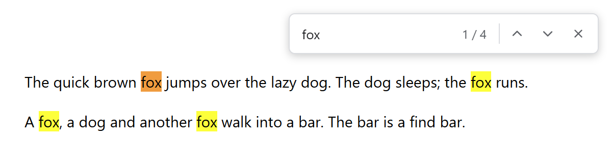
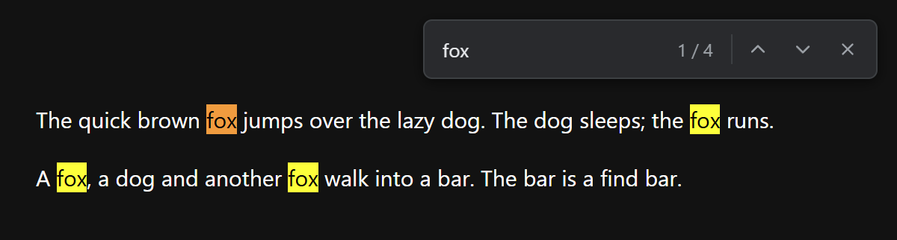

# electron-find-overlay

A find-in-page bar for Electron, built on the browser's native search (`webContents.findInPage`, the same engine as Chrome's Ctrl+F). 




It's a small overlay view in the window's top-right corner, so the search box is never part of the page being searched: the query won't match itself, and typing won't reset the current match.

## Install

```sh
npm install electron-find-overlay
```

Requires Electron 30+. ESM-only (from CommonJS, use `await import()`).

## Usage

```js
import { FindOverlay } from 'electron-find-overlay'

const find = new FindOverlay(win)
find.show()
```

A full app, with the bar opened from the menu on `Ctrl+F` / `Cmd+F`:

```js
import { app, BrowserWindow, Menu } from 'electron'
import { FindOverlay } from 'electron-find-overlay'

app.whenReady().then(() => {
  const win = new BrowserWindow()
  win.loadFile('index.html')

  const find = new FindOverlay(win)

  // The bar registers no shortcuts. A menu accelerator works whether the page or the bar has focus
  Menu.setApplicationMenu(Menu.buildFromTemplate([{
    label: 'Edit',
    submenu: [{ label: 'Find…', accelerator: 'CmdOrCtrl+F', click: () => find.show() }],
  }]))
})
```


## API

```js
const find = new FindOverlay(win, {
  webContents,          // page to search (default: win.webContents, required for a BaseWindow)
  css,                  // extra CSS, see Styling
  width: 320,           // overlay size in px, with room for the shadow
  height: 60,
  offset: 5,            // distance from the top-right corner in px
})

find.show()             // open the bar and focus the input
find.hide()             // close the bar and clear the highlights
find.visible            // true while the bar is open
find.on('show', fn)     // the bar opened
find.on('hide', fn)     // the bar closed
```

## Styling

The bar follows `prefers-color-scheme`. Switch it with `nativeTheme`, which sets the theme for the whole app:

```js
import { nativeTheme } from 'electron'

nativeTheme.themeSource = 'dark'   // 'light', 'dark', or 'system' (default, follows the OS)
```

Pass `css` to restyle it. The built-in styles sit in a cascade layer, so your rules win without `!important`.

```js
new FindOverlay(win, {
  css: `:root {
    --find-bg: #1e1e2e;
    --find-border: #45475a;
    --find-text: #cdd6f4;
    --find-text-muted: #a6adc8;
    --find-shadow: rgba(0, 0, 0, 0.4);
  }`,
})
```

Or use a CSS file. Read it in main, since the bar is its own web contents and your page's CSS doesn't reach it:

```js
import fs from 'node:fs'

new FindOverlay(win, {
  css: fs.readFileSync(new URL('find-theme.css', import.meta.url), 'utf8'),
})
```

## License

MIT
